# TimeR Machine Instruction Manual

This article tries its best to introduce how to use TimeR Machine.

## Table of Contents

1. [Step](#Step)
1. [Reminder](#Reminder)
1. [Behavior](#Behavior)
1. [Start Step and End Step](#Start-Step-and-End-Step)
1. [A Simple Example](#A-Simple-Example)
1. [Advanced - Optional Notifier Step](#Advanced---Optional-Notifier-Step)
1. [Advanced - Group](#Advanced---Group)
1. [Advanced - A Complex Example](#Advanced---A-Complex-Example)
1. [Other](#Other)
1. [Contact](#Contact)

## Step

You can set the name of the timer and its loop. The check mark in the upper right corner is the save button.

In this app, a "**step**" represents a timer, and you want to complete something in this time. Click on the step name and duration to set their contents.

## Reminder

**A normal step will only time, and will not remind you after the end. The easiest way to get a reminder is to add a "Notifier Step" after it.**

There are two ways to add steps:

1. Click the "Notifier Step" button at the bottom to add a new step at the end.

    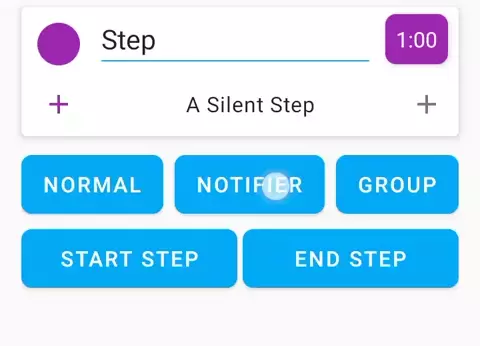

1. Click the plus sign in the lower left corner of the step and select "Notifier Step" to add a new step after this step.

    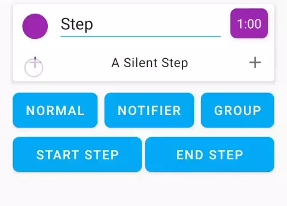

## Behavior

The reason why a notifier step reminds you is that it has some "**behaviors**".

**Behavior** is the reminder of steps. Behaviors equal reminders; no behavior, no reminders.

- There are six types of behaviors: Music, Vibration, Screen, Halt, Voice, Beep. You can view their details in the [detailed explanation of the behavior here](#docs.md/todo).

You can add behavior by clicking the plus sign in the lower right corner of the step.

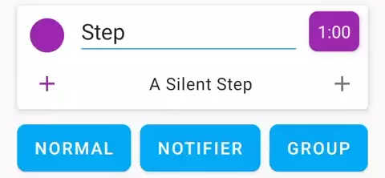

You can also edit a behavior, such as picking a music or if it should loop.

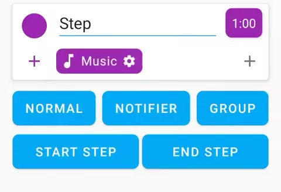

Delete a Step:

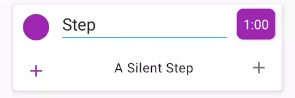

Long press the step/behavior to view its explanation

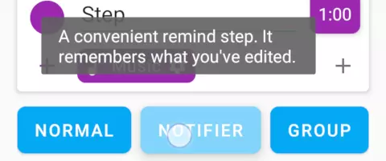

## Start Step and End Step

These two special steps ignore the loop of the timer and only run once at the beginning and end of the entire timer. It reminds you the beginning and end of the entire plan.

At the bottom of the step panel, you can choose to add them.

## A Simple Example

By regular steps to time, notifier steps to remind you, now you can create a simple timer task.

The first green step in the picture below is the start step, and the last red step is the end step.

This is an exercise plan that starts with a 10-second reading "Timer Start" and plays music, then loops three times (5 minutes running + 10 seconds reminder + 1 minute walk + 10 seconds reminder), then 10-second play of music and beep is over.

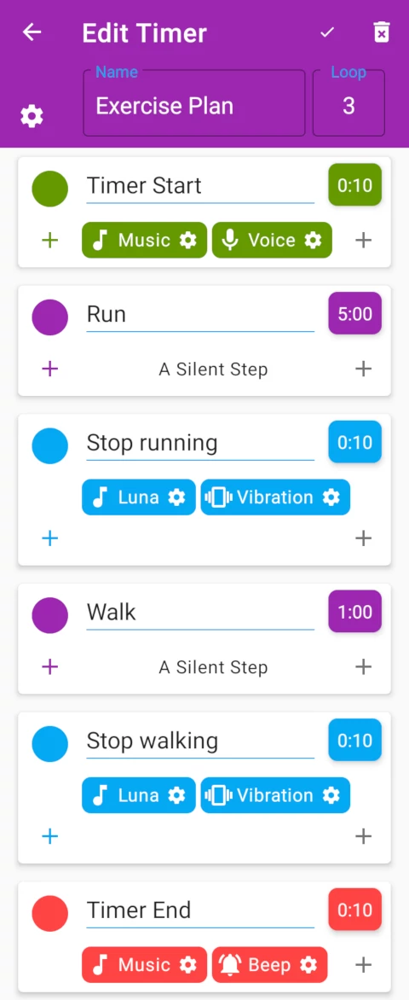

## Advanced - Optional Notifier Step

Because reminders are implemented through behavior, you can add behavior to normal steps to get reminded without having to add a lot of notifier steps.

For example, adding a Voice behavior to a step, the phone will read the step name once at the beginning of the step, so you can know the beginning of a step without a notifier step. Another example: if the Music behavior's loop is turned off, it will play the ringtone once at the beginning of the step.

More similar behavioral features can be viewed [detailed explanation of the behavior here](#docs.md/todo).

In contrast, the notifier step is just a quick way to add reminders, but it has some other features.

- The content after each edit is saved and the same content is added the next time a notifier step is added.
- When you tweak time at a notifier step, the timer will return to the previous step and set the time to 1 minute (this can be turned off in the app settings).

## Advanced - Group

It's a sub-timer in a timer that has its own group name and group loop.

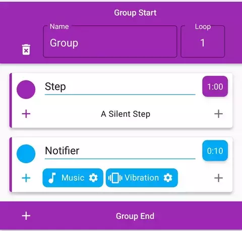

## Advanced - A Complex Example

This is a complex plan for a warm-up + 13-running break cycle + long-distance running + rest.

👇 Note that the timer loop is 1 because the entire plan cannot be simply split into multiple loops and requires more fine control.

We use behavior or notifier steps to get a reminder of the start of a new step.

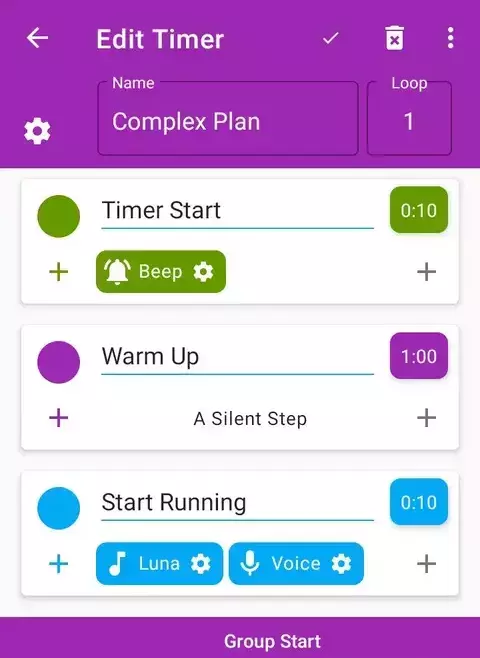

👇 The next "group" begins. Here we put the two steps of running + walking into a group and set the loop to 13 times.

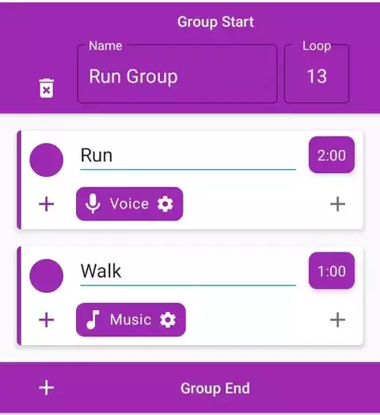

👇 The notification step after the group indicates that the group ends and the long run begins.

After it, we set up a step with a Halt behavior. Our long-distance running may have to run for a few kilometers. We don't know how long it will take. Halt behavior will make this step a positive timing stopwatch, waiting for the next step.

The final end step acts as a rest step.

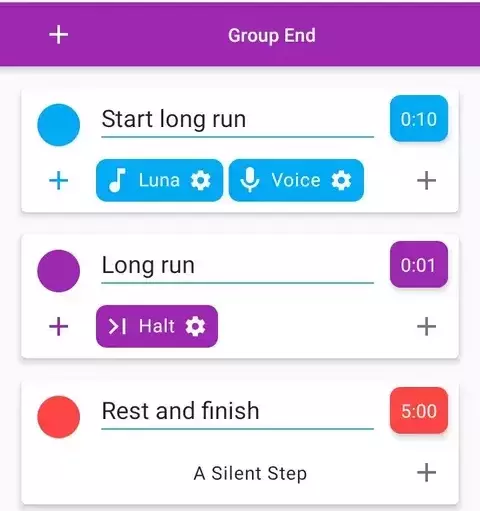
