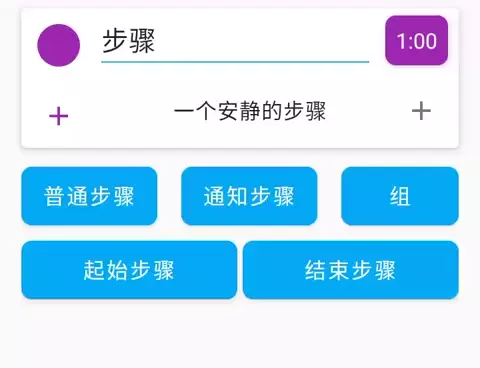
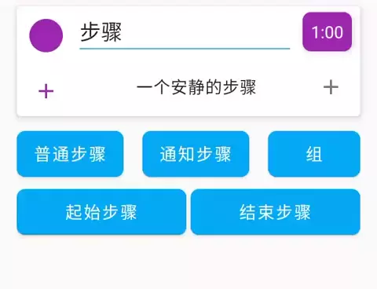
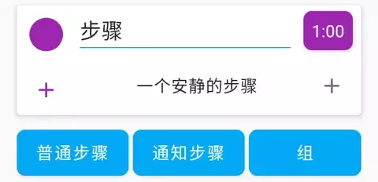
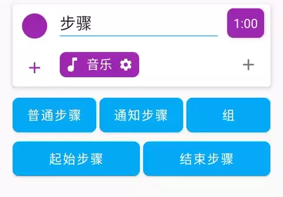
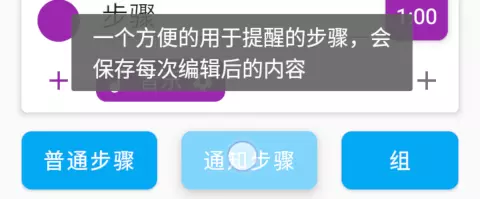
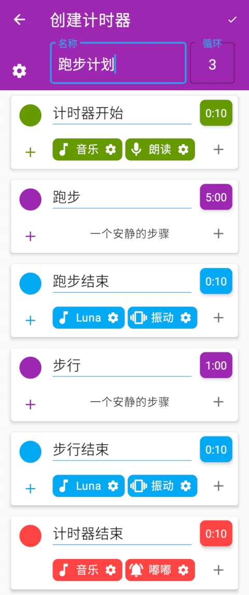
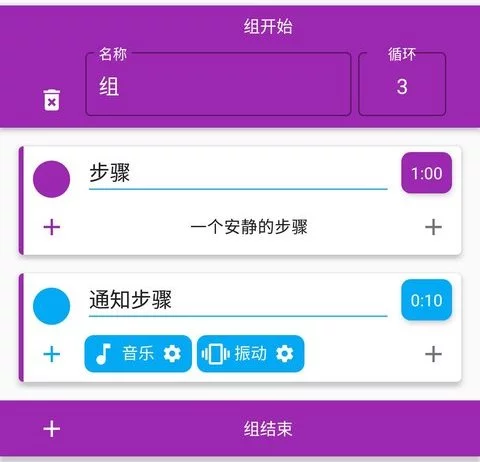
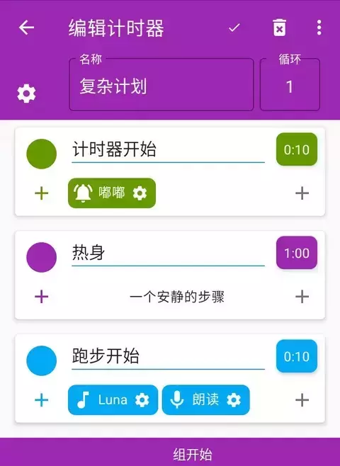
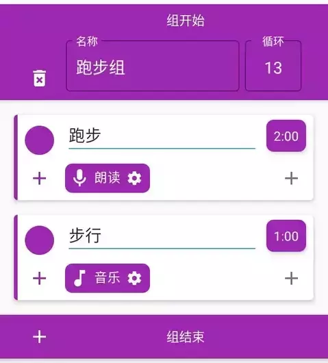
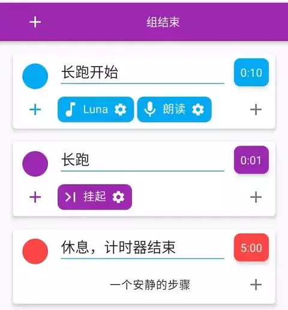

# 计时机器的使用指南

本文非常努力地介绍了计时机器的使用方法。

## 目录

1. [步骤](#步骤)
1. [提醒](#提醒)
1. [行为](#行为)
1. [起始步骤和结束步骤](#起始步骤和结束步骤)
1. [一个简单的例子](#一个简单的例子)
1. [进阶内容 - 可选的通知步骤](#进阶内容---可选的通知步骤)
1. [进阶内容 - 组](#进阶内容---组)
1. [进阶内容 - 一个复杂的例子](#进阶内容---一个复杂的例子)
1. [其他资料](#其他资料)
1. [遇到问题请发邮件吧](#遇到问题请发邮件吧)

## 步骤

你可以设置计时器的名字和循环次数。右上角的对勾是保存按钮。

在计时机器中，一个“**步骤**”代表一个计时器，你要这段时间内完成某一项事情。点击步骤名称和时长可以设置它们的内容。

## 提醒

**一个普通步骤只会计时，在结束后并不会提醒你。最简单的得到提醒的方法是，在它之后添加一个“通知步骤”。**

有两种添加步骤的方式:

1. 点击最下方“通知步骤”按钮，在最后添加一个新步骤。

    

1. 点击步骤左下角的加号，选择“通知步骤”，在此步骤后添加一个新步骤。

    

## 行为

通知步骤之所以可以提醒你，是因为它有一些“**行为**”。

**行为**是步骤的提醒方式。有行为，有提醒；没行为，没提醒。

- 有六种可选择的行为：音乐、振动、屏幕、挂起、朗读、嘟嘟。你可以在[这里的行为的详细解释](docs.md#行为的详细解释)查看它们的具体内容。

可以通过点击步骤右下角的加号，选择要添加的行为。

你也可以编辑一个行为，比如设置音乐曲目或是否循环。

删除步骤

长按步骤/行为查看其解释

## 起始步骤和结束步骤

这两个特殊的步骤无视计时器的循环，只会在整个计时任务的开始和结束运行一次，用于提醒整个计划的开始和结束。

在步骤面板的最下方，可以选择添加它们。

## 一个简单的例子

通过普通步骤来计时，通知步骤来提醒，现在你可以创建一个简单的计时器任务了。

下图第一个绿色的步骤是起始步骤，最后一个红色的步骤是结束步骤。

这是一个锻炼计划，它以10秒钟的朗读“计时器开始”并播放音乐为开始，然后循环三次（5分钟跑步 + 10秒钟提醒 + 1分钟步行 + 10秒钟提醒），然后以10秒钟的播放音乐和嘟嘟音为结束。

## 进阶内容 - 可选的通知步骤

因为提醒是通过行为实现的，因此你可以给普通步骤添加行为来得到提醒，而不需要添加很多通知步骤。

比如给一个步骤添加“朗读”行为，它会在步骤开始时，朗读一次步骤名称，这样你不需要通知步骤也可以知道一个步骤的开始。再比如“音乐”行为，把它的循环关闭后，它也会在步骤开始时，播放选择的铃声一次，

更多的类似行为特性可以[这里的行为的详细解释](docs.md#行为的详细解释)查看。

相比之下，通知步骤只是一个快速添加提醒的方式，但它还有一些其他特性。

- 会保存每次编辑后的内容，并在下一次添加通知步骤时显示相同的内容。
- 在通知步骤微调时间时，计时器会退回上一步骤，并把时间设置为1分钟（设置中可关闭）。

## 进阶内容 - 组

在一个任务中插入一个子计时器，它有自己的组名和组循环。

## 进阶内容 - 一个复杂的例子

这是一个热身+13次跑步休息的循环+长跑+休息的复杂计划。

👇 注意到计时器的循环是1次，这是因为整个计划并不能简单地分割为多次循环，而需要更精细地控制。

我们使用行为或通知步骤来得到新步骤开始的提醒。

👇 接下来一个“组"开始啦。这里我们把跑步+步行的两个步骤放到一个组里，设置循环为13次。

👇 组之后的通知步骤表示组结束，长跑开始。

在它之后，我们设置了一个有挂起行为的步骤。我们的长跑可能要跑个几千米，并不知道要花多少时间，挂起行为就会让这个步骤成为一个正向计时的秒表，等待手动下一步。

最后的结束步骤充当了休息步骤。

## 其他资料

恭喜你完成了使用指南，现在你可以创建复杂的计划，握住时间的咽喉啦。

这里还有一些其他资料：

TODO

## 遇到问题请发邮件吧

在应用内点击菜单-【帮助与反馈】-【反馈】或[直接点击这里](mailto:ligrsidfd@gmail.com)发送邮件。通常会在24小时内得到回复。
